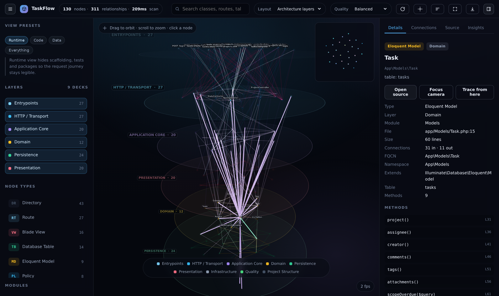
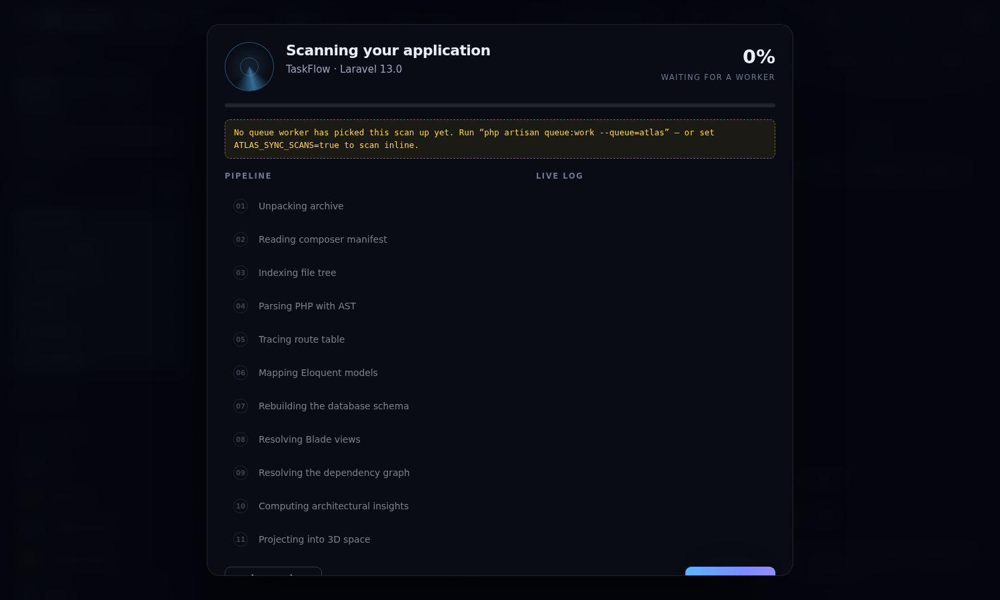
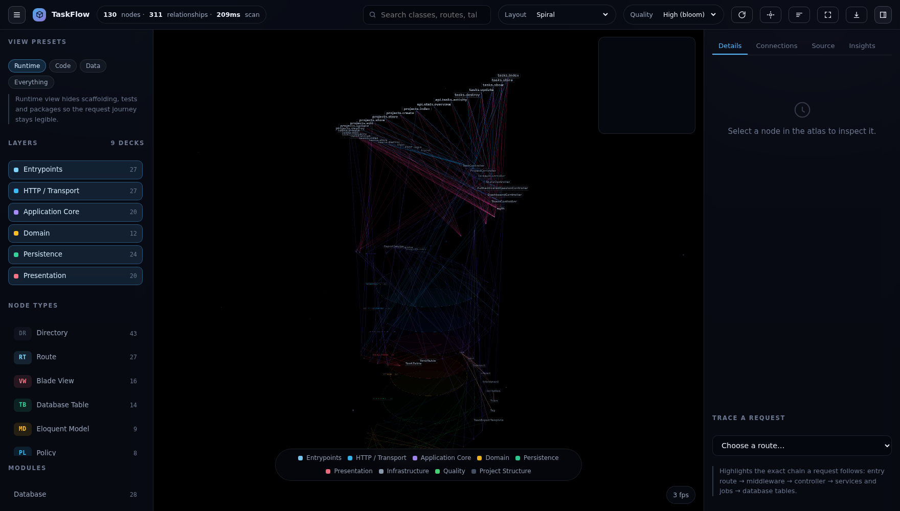

<div align="center">

# AtlasScope

**Upload a Laravel project. Get back a 3D map of it.**

An architecture observatory: every route, controller, model, job, policy, view and
table is parsed with `nikic/php-parser`, linked into a graph, and drawn as a
flyable structure where layers are decks, relationships are light, and a request
journey can be traced end to end.

</div>


---

## What it does

```
   upload .zip  ──▶  11-stage scanner  ──▶  graph + insights  ──▶  interactive 3D atlas
```

1. **You upload** a `.zip` of any Laravel project through the web UI. It is
   unpacked into private storage. Nothing is executed — the scanner is entirely
   static analysis.
2. **The scanner** walks the project: composer manifest, file tree, PHP AST,
   `routes/*.php`, Eloquent models, migrations, Blade views — then resolves how
   everything references everything else.
3. **The atlas** renders the result in the browser with three.js: nodes are
   instanced meshes sized by architectural weight, edges are one line buffer,
   and each layer floats as its own translucent deck.

| | |
|---|---|
|  |  |
| **Trace a request** — pick a route and follow the exact chain through middleware, controller, services and the tables it writes. | **Open any node** — details, connections, source code with the relevant lines highlighted, and the insights that touch it. |
|  |  |
| **View presets** — Runtime, Code, Data (your ERD in 3D) and Everything, or filter by layer, type, module and relationship kind. | **Watch the scan** — the pipeline streams stage by stage with a live log. |

### Three ways to look at the same code

| | |
|---|---|
|  |  |
| **Architecture layers** — one deck per layer, entrypoints on top down to persistence. Reading the atlas top to bottom is reading a request's path. | **Modules** — one disc per module, packed by size, each node on its layer's shelf. Answers "which module owns what" without losing "where it sits". |
|  | |
| **Spiral** — a helix ordered by layer, then by weight. The whole codebase as one strand, biggest nodes first. | |

---

## Requirements

| | |
|---|---|
| PHP | 8.3+ (8.4 tested) with `ext-zip`, `ext-sqlite3` |
| Node | 20+ (to build the front-end assets) |
| Database | SQLite by default — nothing to configure |
| Queue | optional; see [Running a scan](#running-a-scan) |

## Install

```bash
composer install
npm install
cp .env.example .env
php artisan key:generate
php artisan migrate
npm run build        # or: npm run dev
php artisan serve --host=0.0.0.0
```

Open <http://localhost:8000>. Click **Explore the sample project** for a
ready-made demo (TaskFlow, ~90 files) or upload your own archive.

## Running a scan

Scans run on a queue so the upload request returns immediately.

```bash
# in one terminal
php artisan queue:work --queue=atlas
```

If `QUEUE_CONNECTION=sync` (the framework default), scans run inline and no
worker is needed. You can also force either behaviour explicitly:

```dotenv
ATLAS_SYNC_SCANS=true    # always scan inline, no worker required
ATLAS_VERBOSE_SCANS=true # stream every stage to the console
```

While a scan is queued and no worker is consuming, the atlas says so on screen
and tells you the exact command to run — it never just spins.

From the CLI:

```bash
php artisan atlas:scan /path/to/laravel-app --name="My App" --verbose-stages
```

## Uploading your project

AtlasScope accepts a `.zip` of a Laravel project. **Never include `vendor/` or
`node_modules/`** — the scanner is fully static, it reads your own source plus
`composer.json`, and a vendor tree is 200× the useful payload:

```bash
cd /path/to/your-app
zip -r project.zip . -x "vendor/*" -x "node_modules/*" -x ".git/*" \
                      -x "storage/*" -x "public/build/*" -x "bootstrap/cache/*"
```

The landing page always prints the ceiling that applies to *this* server, which
is the lowest of `upload_max_filesize`, `post_max_size` and
`atlas.max_archive_bytes`, read live from `GET /api/atlas/capacity`. Started with
`composer serve` that is the natural 150 MB; with a bare `artisan serve` it is
whatever `php.ini` says, which on a stock PHP is 2 MB. Guards:

* the browser checks the file size before submitting and tells you the number and
  the fix, instead of letting the request die;
* if a body is still too large for PHP, you get a readable **413** page with the
  current limits and the `zip -x` recipe, not a blank 419 or a stack trace.

### Large archives just work — no configuration

PHP's `upload_max_filesize` and `post_max_size` only govern **multipart form
uploads**. A raw request body is not form data, so neither limit applies to it —
measured on a stock install configured for 2 MB, a 12 MB body arrives intact.

AtlasScope uses that: when an archive is bigger than the PHP limit, the browser
slices it into ~1 MB pieces, streams them to `PUT /uploads/{token}`, and the
server stitches them back together before unpacking. You get a progress bar, and
it works on an untouched `php artisan serve`, behind a proxy, on shared hosting —
**no php.ini, no restarts, no terminal commands.**

| What you want | What to do |
|---|---|
| Upload up to 150 MB | nothing — the default, streamed in pieces when needed |
| Upload more than 150 MB | `ATLAS_MAX_ARCHIVE_BYTES=1073741824` in `.env` |
| Also raise PHP's own limits (local dev) | `composer serve` → `php artisan atlas:serve` |

Setting up Herd, Valet, Sail, XAMPP, MAMP or a Linux server? Step-by-step paths,
verification commands and the seven reasons a changed limit "does not stick" are
in **[docs/SERVER-SETUP.md](docs/SERVER-SETUP.md)**.

The landing page prints the live ceiling from `GET /api/atlas/capacity` and says
which limit is in play, and a file over the ceiling is never a dead end: you get
an **Upload it anyway** button and a readable error if the server still refuses.

> **Two gotchas worth knowing.** `php -d upload_max_filesize=150M artisan serve`
> does *not* work — `artisan serve` spawns a **child** `php -S` and the `-d` flags
> die with the parent; `php artisan atlas:serve` puts the flags on the child
> invocation, which is the only place they matter. And the reason a big upload
> "just fails" on a stock server is that PHP discards the body *before* Laravel
> runs, so there is no CSRF token and the old symptom was a confusing 419.

## What the scanner extracts

Eleven stages run in order, each writing a JSON artefact to
`storage/app/atlas/{project}/.atlas/` so the intermediate understanding of your
code is inspectable, not just the end result.

| # | Stage | Produces |
|---|-------|----------|
| 01 | Extract | Safe unzip, root detection, size + file measurement |
| 02 | Manifest | `composer.json` → framework version, packages, config surface |
| 03 | FileIndex | File tree, LOC per file, language mix |
| 04 | ClassParse | AST → classes, methods, imports, attributes, extending/implements |
| 05 | Route | Route files reconstructed: verbs, URIs, names, middleware stacks, controller actions |
| 06 | Models | Eloquent models, `$fillable`, `$casts`, relationships, policies |
| 07 | Schema | Migrations → tables, columns, foreign keys |
| 08 | Views | Blade views, components, `<x-…>` usage, `@include` graph |
| 09 | Links | Reference resolution — short class names to FQCNs, then edges |
| 10 | Insights | Coupling hotspots, layering violations, policy/test/database gaps |
| 11 | Layout | Deterministic 3D projection: layers become decks, golden-angle spiral inside them |

Three projections are available in the atlas — **Architecture layers**, **Modules**
and **Spiral** — all reprojected in the browser from the same graph.

Node types include routes, controllers, middleware, form requests, API
resources, policies, models, services, actions, jobs, events, listeners,
notifications, mailables, commands, observers, rules, enums, DTOs, providers,
config files, Blade views, Livewire components, migrations, database tables,
factories, seeders, tests and composer packages.

Relationship kinds: `http`, `guards`, `validates`, `authorizes`, `uses`,
`injects`, `dispatches`, `renders`, `includes`, `persists`, `owns`,
`belongs_to`, `pivot`, `migrates`, `extends`, `tests`, `provides`, `queue`,
`notifies`, `schedules`, and more.

## Using the atlas

| Action | How |
|---|---|
| Orbit / zoom / focus | drag, scroll, click a node |
| Search | type in the top bar — an **×** appears inside the field to clear it (`Esc` while typing clears it too); `Enter` selects the strongest match |
| Trace a request | pick a route in **Trace a request** (inspector, bottom) |
| Switch layout | **Architecture layers / Modules / Spiral** in the top bar — a progress card in the bottom-right shows the engine rebuilding and then the nodes' actual travel, so a switch never looks like a freeze. Filtered-out nodes are held at their deck home so they slot back in when the filter is lifted |
| View presets | **Runtime**, **Code**, **Data**, **Everything** in the rail |
| Filter | click any layer, node type, module or relationship kind in the rail |
| Focus | selecting a node (or tracing a request) dims everything that is not on that path — toggle with the focus button in the top bar or `d` |
| Route focus | selecting a route greys out **every other route** and its glow, so the chosen route and everything connected to it are the only coloured things left |
| Journey | the tracer follows the request to the table it writes to and stops there, lighting **only the links the journey walks** — every other line that happens to touch a step is pushed back to 8% |
| Inspect | right panel: Details · Connections · Source · Insights |
| Jump from an insight | open the **Insights** tab and click a finding |
| Minimap | click anywhere on it to fly the camera there |
| Export | the download button in the top bar → full graph JSON |

Keyboard: `f` fit, `l` labels, `d` dim-to-focus, `r` auto-rotate, `Esc` clear selection (or clear the
search while the search field has focus), `/` search.

The query is part of the URL, so a cleared search is cleared in the link too —
reloading or sharing never resurrects a query you just dismissed.

Views are deep-linkable — `?node=…&layout=…&view=…&q=…` — so you can send a
colleague the exact thing you are looking at.

If the frame rate drops (a big project plus bloom on integrated graphics), the
renderer steps itself down to the balanced or performance preset and tells you;
you can always pin it back from the **Quality** menu.

## HTTP API

Everything the UI does is available over JSON:

| Method | Endpoint | Purpose |
|---|---|---|
| `GET` | `/api/atlas/projects/{project}/graph` | Full renderer payload; `202 {ready:false}` while scanning |
| `GET` | `/api/atlas/projects/{project}/status` | Scan status, stage list, progress |
| `GET` | `/api/atlas/projects/{project}/events?after=` | Incremental scan log |
| `GET` | `/api/atlas/projects/{project}/nodes/{key}` | Node detail + incoming/outgoing edges |
| `GET` | `/api/atlas/projects/{project}/neighbourhood?key=&depth=` | Subgraph around a node |
| `GET` | `/api/atlas/projects/{project}/search?q=` | Search nodes |
| `GET` | `/api/atlas/projects/{project}/file?path=` | File contents (containment-checked, text files only) |
| `GET` | `/api/atlas/projects/{project}/export` | Download the whole graph as JSON |

`{key}` is a node key such as `class:App\Models\Task` or `route:GET /tasks`.
Keys are URL encoded in the path.

## Configuration

`config/atlas.php`:

```php
'max_archive_bytes' => env('ATLAS_MAX_ARCHIVE_BYTES', Ini::devBytes('upload_max')), // 150 MB ceiling
'max_extracted_bytes' => env('ATLAS_MAX_EXTRACTED_BYTES', 2_147_483_648), // zip-bomb guard, not a size policy
'sync_scans'        => env('ATLAS_SYNC_SCANS', env('QUEUE_CONNECTION') === 'sync'),
'verbose_scans'     => env('ATLAS_VERBOSE_SCANS', false),
'max_render_nodes'  => env('ATLAS_MAX_RENDER_NODES', 2500),
'max_render_edges'  => env('ATLAS_MAX_RENDER_EDGES', 6000),
'demo_enabled'      => env('ATLAS_DEMO_ENABLED', true),
```

Projects live in `storage/app/atlas/{uuid}` (private). Deleting a project from
the UI removes both its rows and its files.

## Project structure

```
app/
  Console/Commands/ScanProjectCommand.php   php artisan atlas:scan
  Enums/                                    NodeType, Layer, EdgeKind, ScanStage, ScanStatus
  Http/Controllers/                         ProjectController (UI + API), AtlasApiController
  Jobs/RunScan.php                          queued scan worker
  Services/ProjectManager.php               upload → unpack → project row → scan
  Services/GraphPayload.php                 renderer payload shaping
  Services/Scan/ScanPipeline.php            runs the stages, persists the graph
  Services/Scan/Parsers/                    Composer, FileIndex, ClassParse, Route, Model,
                                            Migration, View
  Services/Scan/Stages/                     the eleven stages
  Support/                                  Path sandbox, GraphBuilder, NameResolver
resources/
  css/app.css                               hand-written design system (no utility framework)
  js/atlas/                                 api, store, layouts, scene, inspector, trace, scan, ui
  views/                                    landing, project report, atlas
```

## Tests

```bash
php artisan test
```

## Notes & limits

- Static analysis only: no code from an uploaded project is ever executed.
- The parser reads PHP with `nikic/php-parser`; it does not boot the target app,
  so dynamic container binding and runtime-computed routes are out of reach.
- Extremely large graphs are thinned to `max_render_nodes` / `max_render_edges`
  before rendering; everything is always present in the JSON export.
- The layout is deterministic — the same project always lands in the same place,
  which makes scans comparable over time.

<div align="center"><sub>Built with Laravel 13, three.js and nikic/php-parser.</sub></div>
